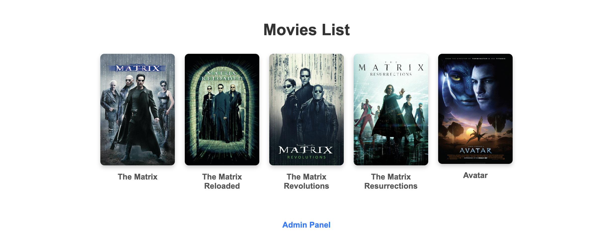
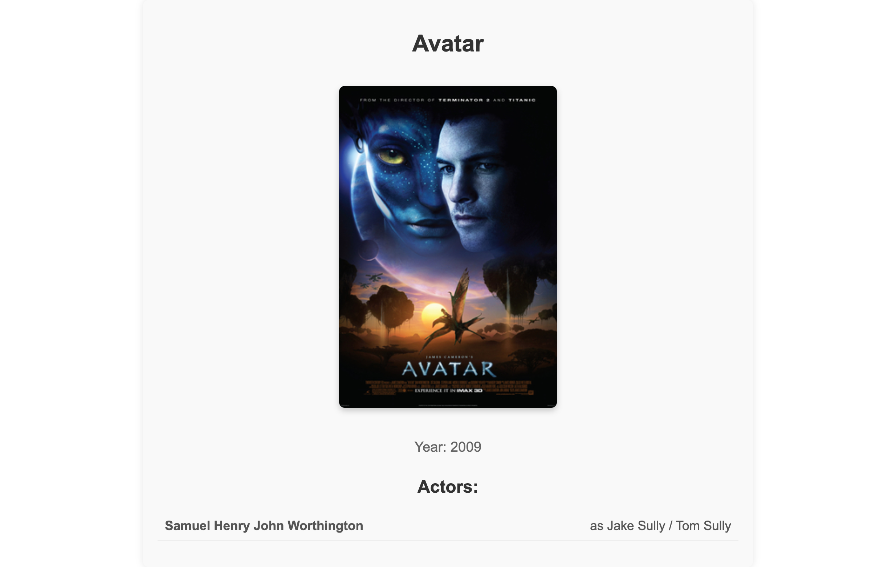
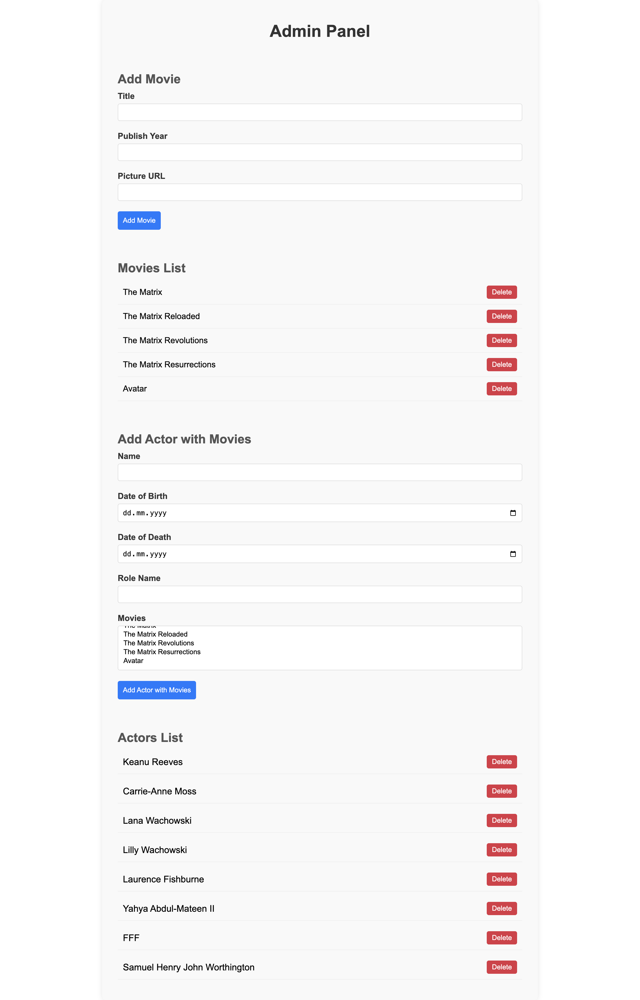

# Movie Database Application

## Description

This project is a demo application with essential features for managing a movie database. It is based on the development branch of the original repository, with the following additions:

- A simple frontend for displaying a list of movies and details for each movie.
- Basic CRUD functionality (Create, Read, Delete) for movies and actors, implemented in an admin panel (note: no Update "U" functionality).

## Differences from the original

- Added components to display a movie list and movie details.
- Implemented an admin panel for adding movies and actors, with the ability to link actors to movies.
- Does not include comprehensive error handling or full CRUD functionality.

## Database

To set up the database:

1. In your terminal, navigate to the project directory (the same directory where this README is located).
1. Run the following commands:

```
dropdb movies
createdb movies
psql movies < docs/movies-with-more-data.sql
```

## Development

Install dependencies:

```
npm i
```

Create an environment file, open and edit the `.env` file as necessary:

```
cp .env.example .env
```

Run Kysely code generation:

```
npm run kysely-codegen
```

Start the API server, the API will be available at http://localhost:10000 or at the port specified in your configuration:

```
npm run server
```

Start the frontend development server, the frontend will be available at http://localhost:5173 or at the port specified in your configuration:

```
npm run dev
```

## Screenshots

### Movies List

Displays a list of movies with posters and titles.



### Movie Details

Shows detailed information about a selected movie, including poster, release year, and actors.



### Admin Panel

A basic interface for managing movies and actors.


